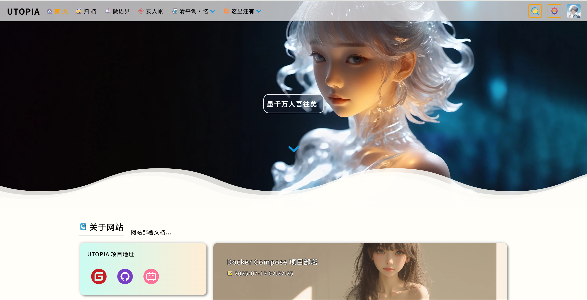
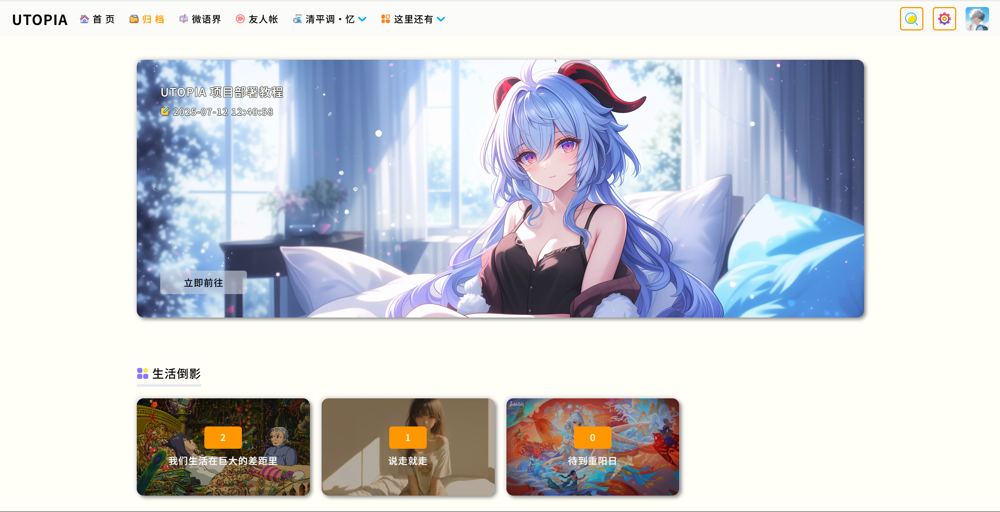
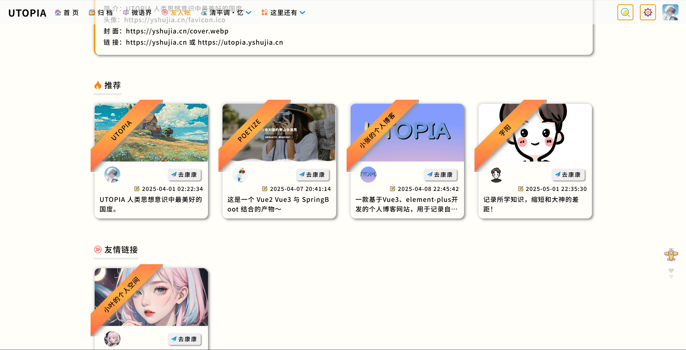
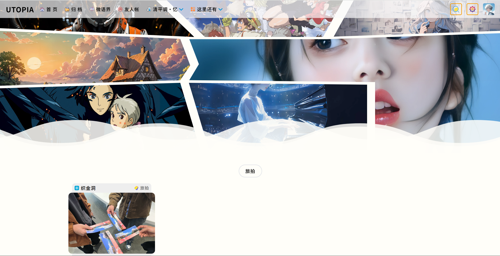
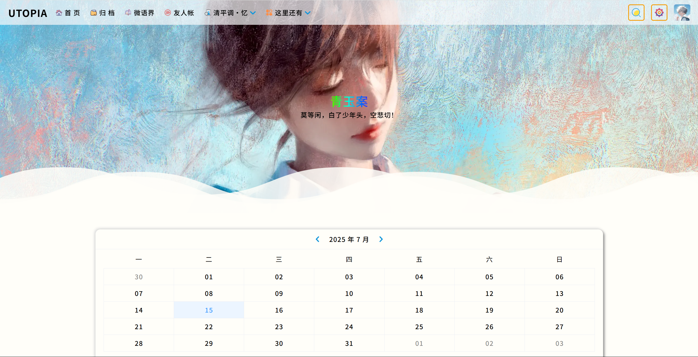
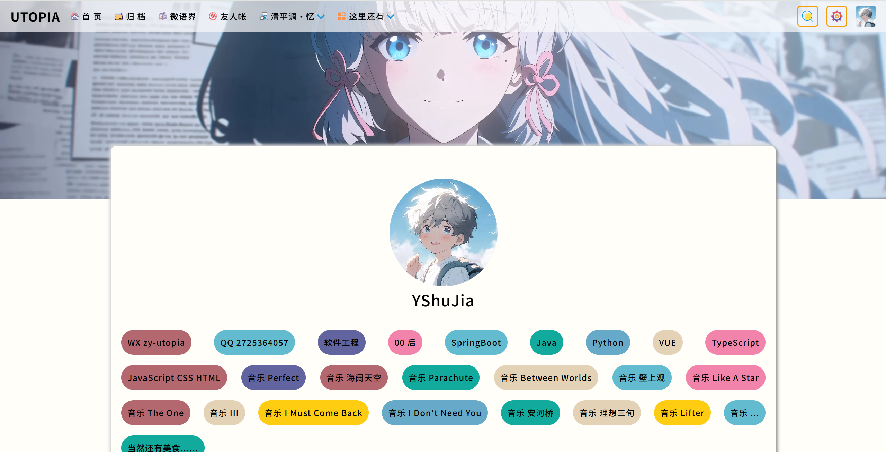
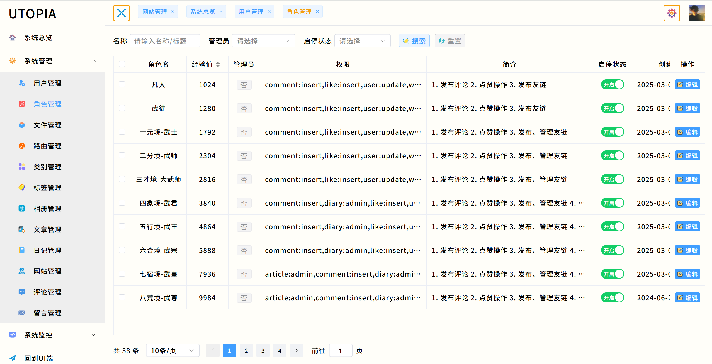
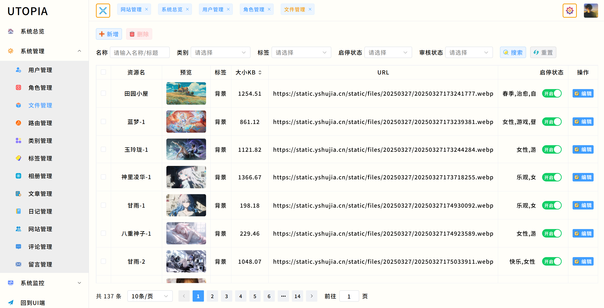
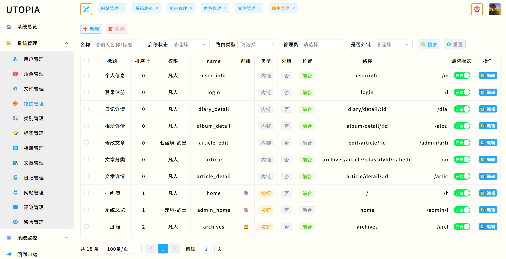
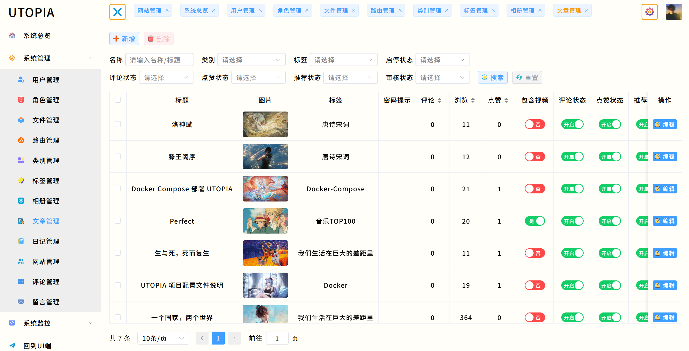

###  🌈 一个基于 Springboot3 + Vue3 实现的个人博客

UTOPIA 寓意为人类思想意识中最美好的国度，一直想要开发一个个人博客网站，但因为种种原因一直未能完成，直到后面接触到越来多大佬的博客，才终于决定开始做博客。博客地址：https://yshujia.cn

- 2023-2024：使用 Vue3 + Ant Design，后端使用 SpringBoot2 搭建了博客系统前端UI，但是对UI美化一直不是很满意。

- 2024-2025：重新使用 Vue3 + Element Plus 和 SpringbBoot3 搭建系统，UI 参考了不少大佬的设计，且在 https://uiverse.io/ 中获得了不少灵感，网站缝缝补补就写的差不多了。
- 2025-至今：开始维护博客系统，完善系统功能和细节，打磨网站UI。

开源不易，动动你的小手点个 Star 吧！项目在持续更新中...

### 🛠️ 技术栈

|      | 技术                                                         |
| ---- | ------------------------------------------------------------ |
| 前端 | Vue3 + Pinia + Axios + Socket.IO + ElementPlus + TypeScritp + Tailwindcss + Echarts + Dayjs ... |
| 后端 | Springboot3 + SpringSecurity + MybatisPlus + JWT + Socket.IO + Redis + MySql + MinIO + Mail ... |
| 部署 | Docker + Nginx ...                                           |

### 💫 网站页面展示

> #### 首页

> #### 文章归档页面

> #### 留言页面

> #### 友情链接页面

> #### 相册页面

> #### 日记页面

> #### 关于页面

### 💫 网站管理端

> #### 角色管理页面

> #### 文件管理页面

> #### 路由管理页面

> #### 文章管理页面

> #### 查看更多内容请前往 https://yshujia.cn
